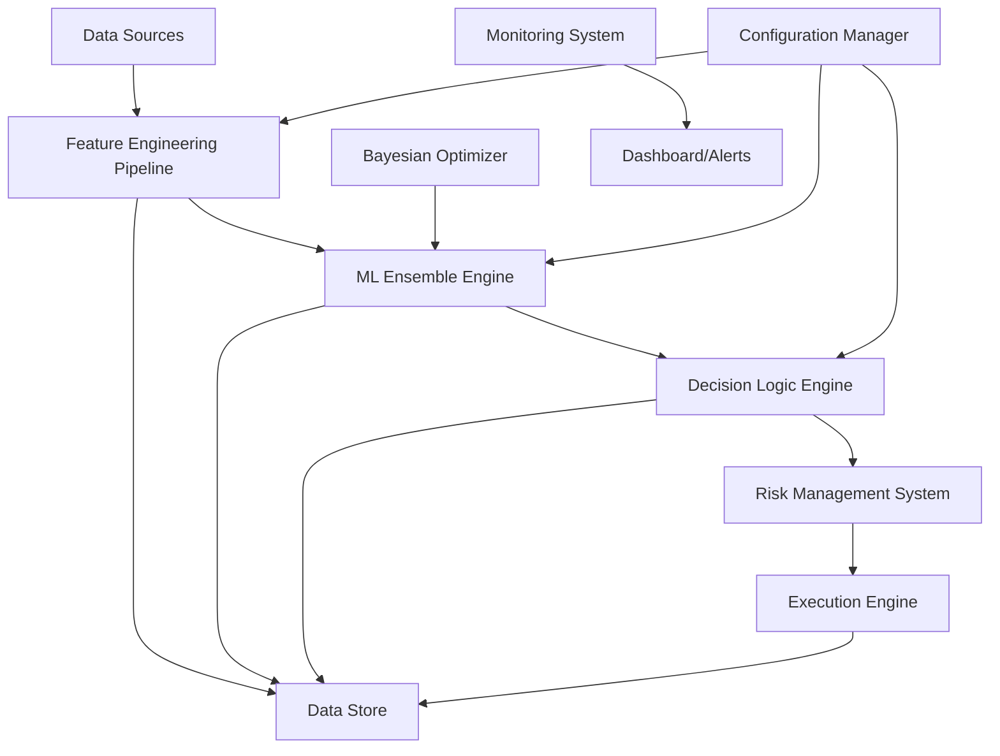

# System Architecture Documentation

*Production ML Decision System - Technical Architecture Overview*

---

## Table of Contents
- [System Overview](#system-overview)
- [Architecture Principles](#architecture-principles)
- [Component Architecture](#component-architecture)
- [Data Flow](#data-flow)
- [Technology Stack](#technology-stack)
- [Scalability & Performance](#scalability--performance)
- [Monitoring & Observability](#monitoring--observability)
- [Deployment Architecture](#deployment-architecture)
- [Security Considerations](#security-considerations)
- [Future Enhancements](#future-enhancements)

---

## System Overview

The Production ML Decision System is an enterprise-grade platform designed for high-frequency sequential pattern recognition and automated decision-making. Built over 8 years of iterative development, it combines advanced machine learning techniques with production-grade engineering practices.

### Core Objectives
- **Real-time Decision Making**: Sub-200ms latency for critical decisions
- **Scalable Processing**: Handle 25M+ simulations in 3-hour cycles
- **Business ROI**: Deliver measurable performance improvements (18-35%)
- **Production Reliability**: 99.7% uptime with comprehensive monitoring
- **Adaptive Learning**: Continuous parameter optimization and model evolution

---

## Architecture Principles

### 1. **Modularity & Separation of Concerns**
```
┌─────────────────┐  ┌─────────────────┐  ┌─────────────────┐
│  Data Ingestion │  │  ML Processing  │  │  Decision Exec  │
│     Layer       │  │     Layer       │  │     Layer       │
└─────────────────┘  └─────────────────┘  └─────────────────┘
         │                     │                     │
         ▼                     ▼                     ▼
┌─────────────────┐  ┌─────────────────┐  ┌─────────────────┐
│   Monitoring    │  │   Optimization  │  │   Persistence   │
│     Layer       │  │     Layer       │  │     Layer       │
└─────────────────┘  └─────────────────┘  └─────────────────┘
```

### 2. **Event-Driven Architecture**
- Asynchronous processing with Celery task queues
- Event sourcing for audit trails and replay capability
- Pub/sub pattern for real-time monitoring

### 3. **Fail-Safe Design**
- Circuit breaker patterns for external dependencies
- Graceful degradation when components fail
- Comprehensive error handling and recovery mechanisms

### 4. **Observability First**
- Extensive logging and metrics collection
- Real-time monitoring dashboards
- Performance tracking and alerting

---

## Component Architecture

### Core System Components



### 1. **Data Ingestion & Feature Engineering**

#### Feature Engineering Pipeline
```python
class FeatureEngineeringPipeline:
    """
    Multi-stage feature engineering with real-time processing
    """
    def __init__(self, config):
        self.rolling_windows = [5, 10, 20, 50]  # Multiple timeframes
        self.volatility_engines = VolatilityCalculators()
        self.momentum_indicators = MomentumAnalyzers()
        
    def process_real_time(self, data_stream):
        features = {
            'rolling_stats': self._calculate_rolling_statistics(data_stream),
            'volatility_measures': self._calculate_volatility(data_stream),
            'momentum_indicators': self._calculate_momentum(data_stream),
            'regime_classification': self._classify_market_regime(data_stream)
        }
        return self._normalize_and_validate(features)
```

#### Technical Specifications
- **Input Processing**: Real-time data streams, batch processing, historical data
- **Feature Types**: Rolling statistics, volatility measures, momentum indicators, regime classification
- **Performance**: <50ms feature calculation latency
- **Scalability**: Vectorized operations using pandas/NumPy

### 2. **ML Ensemble Engine**

#### Model Architecture
```python
class MLEnsembleEngine:
    """
    Multi-model ensemble with dynamic weighting
    """
    def __init__(self, config):
        self.models = {
            'random_forest': RandomForestClassifier(**config.rf_params),
            'xgboost': XGBClassifier(**config.xgb_params),
            'svm': SVC(**config.svm_params),
            'logistic': LogisticRegression(**config.lr_params)
        }
        self.weights = self._initialize_dynamic_weights()
        
    def predict_ensemble(self, features):
        predictions = {}
        confidences = {}
        
        for name, model in self.models.items():
            pred = model.predict_proba(features)
            predictions[name] = pred
            confidences[name] = self._calculate_confidence(pred)
            
        return self._weighted_ensemble_decision(predictions, confidences)
```

#### Model Selection Rationale
- **Random Forest**: Primary classifier for stable, interpretable predictions
- **XGBoost**: Gradient boosting for capturing non-linear relationships
- **SVM**: Linear classifier for baseline comparison and robustness
- **Logistic Regression**: Probabilistic output for confidence calibration

#### Dynamic Weight Adjustment
```python
def update_model_weights(self, recent_performance):
    """
    Exponentially weighted moving average for model weight updates
    """
    decay_factor = 0.95
    for model_name, performance in recent_performance.items():
        self.weights[model_name] = (
            self.weights[model_name] * decay_factor + 
            performance * (1 - decay_factor)
        )
    self._normalize_weights()
```

### 3. **Bayesian Optimization Engine**

#### Optimization Architecture
```python
class AdvancedBayesianOptimizer:
    """
    Custom Bayesian optimization with multi-objective capabilities
    """
    def __init__(self, parameter_space):
        self.sampler = optuna.samplers.TPESampler(
            n_startup_trials=50,
            n_ei_candidates=24,
            multivariate=True
        )
        self.parameter_space = parameter_space
        self.convergence_detector = ConvergenceDetector()
        
    def optimize_multi_objective(self, objective_functions):
        study = optuna.create_study(
            directions=['maximize'] * len(objective_functions),
            sampler=self.sampler
        )
        
        def combined_objective(trial):
            results = {}
            for name, func in objective_functions.items():
                results[name] = func(trial)
            return self._pareto_optimization(results)
```

#### Parameter Space Definition
- **Model Hyperparameters**: Learning rates, regularization, tree depth
- **Feature Engineering**: Window sizes, volatility lookbacks, thresholds
- **Business Logic**: Risk limits, profit targets, exit strategies
- **System Parameters**: Batch sizes, timeout values, confidence thresholds

### 4. **Decision Logic Engine**

#### Multi-Stage Decision Framework
```python
class DecisionLogicEngine:
    """
    Multi-stage decision making with risk management
    """
    def __init__(self, config):
        self.confidence_threshold = config.confidence_threshold
        self.risk_manager = RiskManagementSystem(config)
        self.exit_strategy_manager = ExitStrategyManager(config)
        
    def make_decision(self, ml_predictions, context):
        # Stage 1: Confidence filtering
        if ml_predictions.confidence < self.confidence_threshold:
            return Decision.NO_ACTION
            
        # Stage 2: Risk assessment
        risk_score = self.risk_manager.assess_risk(ml_predictions, context)
        if risk_score > self.risk_manager.max_risk:
            return Decision.RISK_REJECTED
            
        # Stage 3: Exit strategy evaluation
        exit_signal = self.exit_strategy_manager.evaluate_exits(context)
        if exit_signal.should_exit:
            return Decision.EXIT_POSITION
            
        # Stage 4: Position sizing
        position_size = self._calculate_position_size(ml_predictions, risk_score)
        return Decision.TAKE_ACTION(position_size)
```

### 5. **Risk Management System**

#### Risk Assessment Framework
```python
class RiskManagementSystem:
    """
    Comprehensive risk management with multiple safety layers
    """
    def __init__(self, config):
        self.drawdown_monitor = DrawdownMonitor(config.max_drawdown)
        self.position_sizer = KellyCriterionSizer()
        self.correlation_tracker = CorrelationTracker()
        
    def assess_comprehensive_risk(self, context):
        risk_factors = {
            'portfolio_heat': self._calculate_portfolio_heat(),
            'correlation_risk': self._assess_correlation_risk(),
            'volatility_regime': self._detect_volatility_regime(),
            'drawdown_proximity': self._check_drawdown_proximity(),
            'consecutive_losses': self._count_consecutive_losses()
        }
        
        return self._aggregate_risk_score(risk_factors)
```

---

## Data Flow

### Real-Time Processing Pipeline

```
┌─────────────┐    ┌───────────────┐    ┌─────────────┐
│ Data Source │───▶│ Validation &  │───▶│ Feature     │
│             │    │ Cleansing     │    │ Engineering │
└─────────────┘    └───────────────┘    └─────────────┘
                                                │
┌─────────────┐    ┌───────────────┐           │
│ Decision    │◀───│ ML Ensemble   │◀──────────┘
│ Engine      │    │ Processing    │
└─────────────┘    └───────────────┘
       │
       ▼
┌─────────────┐    ┌───────────────┐    ┌─────────────┐
│ Risk        │───▶│ Execution     │───▶│ Result      │
│ Management  │    │ Engine        │    │ Logging     │
└─────────────┘    └───────────────┘    └─────────────┘
```

### Batch Processing Pipeline

```
┌─────────────┐    ┌───────────────┐    ┌─────────────┐
│ Historical  │───▶│ Batch Feature │───▶│ Model       │
│ Data        │    │ Generation    │    │ Training    │
└─────────────┘    └───────────────┘    └─────────────┘
                                                │
┌─────────────┐    ┌───────────────┐           │
│ Performance │◀───│ Backtesting   │◀──────────┘
│ Analysis    │    │ Engine        │
└─────────────┘    └───────────────┘
       │
       ▼
┌─────────────┐    ┌───────────────┐
│ Parameter   │───▶│ Model         │
│ Optimization│    │ Deployment    │
└─────────────┘    └───────────────┘
```

---

## Technology Stack

### Core ML & Data Processing
```yaml
Machine Learning:
  - scikit-learn: 1.3+     # Primary ML framework
  - XGBoost: 1.7+          # Gradient boosting
  - Optuna: 3.0+           # Bayesian optimization
  - pandas: 2.0+           # Data manipulation
  - NumPy: 1.24+           # Numerical computing

AI Integration:
  - OpenAI API: GPT-4      # Dynamic rule evolution
  - LangChain: 0.0.300+    # LLM orchestration
```

### Web Framework & API
```yaml
Backend:
  - Flask: 2.3+            # Web framework
  - Celery: 5.3+           # Async task processing
  - Redis: 7.0+            # Message broker & cache
  - SQLite: 3.40+          # Lightweight database

API & Communication:
  - RESTful API design
  - JSON data exchange
  - WebSocket real-time updates
```

### Monitoring & Visualization
```yaml
Monitoring:
  - Plotly: 5.15+          # Interactive dashboards
  - psutil: 5.9+           # System monitoring
  - Custom logging framework

Data Storage:
  - Apache Parquet         # Columnar storage
  - SQLite                 # Structured data
  - JSON files             # Configuration
```

### Development & Testing
```yaml
Testing:
  - pytest: 7.4+          # Testing framework
  - Black: 23.0+           # Code formatting
  - Ruff: 0.0.280+         # Linting

CI/CD:
  - GitHub Actions         # Automation
  - Docker: 24.0+          # Containerization
```

---

## Scalability & Performance

### Performance Characteristics

#### Latency Requirements
```yaml
Feature Engineering:    < 50ms  (real-time processing)
ML Prediction:         < 100ms (ensemble inference) 
Decision Generation:   < 200ms (total pipeline)
Risk Assessment:       < 50ms  (safety checks)
```

#### Throughput Capabilities
```yaml
Simulation Processing:  25M+ simulations / 3 hours
Parameter Optimization: 500+ combinations / study
Concurrent Requests:    100+ simultaneous decisions
Data Processing:        10k+ records / second
```

### Scalability Strategies

#### Horizontal Scaling
```python
class ScalableProcessingArchitecture:
    """
    Horizontal scaling with Celery worker pools
    """
    def __init__(self):
        self.celery_app = Celery('ml_processor')
        self.worker_pools = {
            'feature_engineering': 4,  # CPU-intensive
            'ml_inference': 8,         # Model prediction
            'optimization': 2,         # Memory-intensive
            'monitoring': 1            # I/O bound
        }
        
    @celery_app.task(queue='ml_inference')
    def process_ml_prediction(self, features):
        return self.ml_engine.predict(features)
        
    @celery_app.task(queue='optimization')
    def run_parameter_optimization(self, trial_config):
        return self.optimizer.run_trial(trial_config)
```

#### Memory Optimization
```python
class MemoryOptimizedProcessor:
    """
    Memory-efficient processing for large parameter spaces
    """
    def __init__(self):
        self.chunk_size = 10000
        self.memory_monitor = MemoryMonitor()
        
    def process_large_simulation(self, total_simulations):
        for chunk_start in range(0, total_simulations, self.chunk_size):
            chunk_end = min(chunk_start + self.chunk_size, total_simulations)
            
            # Process chunk with memory monitoring
            with self.memory_monitor.track():
                chunk_results = self._process_simulation_chunk(
                    chunk_start, chunk_end
                )
                
            # Yield results to prevent memory accumulation
            yield chunk_results
            
            # Force garbage collection if memory usage high
            if self.memory_monitor.usage_mb > 1000:
                gc.collect()
```

---

## Monitoring & Observability

### Real-Time Monitoring Architecture

```python
class MonitoringSystem:
    """
    Comprehensive monitoring with real-time dashboards
    """
    def __init__(self):
        self.metrics_collector = MetricsCollector()
        self.dashboard_manager = DashboardManager()
        self.alert_manager = AlertManager()
        
    def collect_system_metrics(self):
        return {
            'performance': {
                'latency_p95': self._measure_latency_percentile(95),
                'throughput_rps': self._measure_requests_per_second(),
                'error_rate': self._calculate_error_rate(),
                'memory_usage_mb': self._get_memory_usage()
            },
            'business': {
                'decisions_per_hour': self._count_decisions(),
                'profit_factor': self._calculate_profit_factor(),
                'win_rate': self._calculate_win_rate(),
                'max_drawdown': self._track_max_drawdown()
            },
            'ml_model': {
                'prediction_confidence': self._avg_confidence(),
                'model_drift_score': self._detect_model_drift(),
                'feature_importance_changes': self._track_feature_changes()
            }
        }
```

### Dashboard Components

#### 1. **System Health Dashboard**
- Real-time performance metrics (latency, throughput, errors)
- Memory usage and resource utilization
- Component status and dependency health
- Alert status and recent incidents

#### 2. **Business Metrics Dashboard**
```python
business_metrics = {
    'real_time_pnl': 'Live profit/loss tracking',
    'decision_distribution': 'Distribution of decision types',
    'risk_exposure': 'Current risk metrics and limits',
    'client_performance': 'Per-client performance breakdown'
}
```

#### 3. **ML Model Performance Dashboard**
```python
ml_metrics = {
    'prediction_accuracy': 'Model accuracy over time',
    'confidence_distribution': 'Prediction confidence levels',
    'feature_importance': 'Dynamic feature importance tracking',
    'model_drift_detection': 'Distribution shift monitoring'
}
```

### Alerting Framework

```python
class AlertingFramework:
    """
    Multi-channel alerting with escalation policies
    """
    def __init__(self):
        self.channels = {
            'slack': SlackNotifier(),
            'email': EmailNotifier(),
            'sms': SMSNotifier()
        }
        self.escalation_policies = EscalationPolicyManager()
        
    def trigger_alert(self, alert_type, severity, message):
        policy = self.escalation_policies.get_policy(alert_type, severity)
        
        for step in policy.escalation_steps:
            if step.condition_met():
                self.channels[step.channel].send_alert({
                    'type': alert_type,
                    'severity': severity,
                    'message': message,
                    'timestamp': datetime.utcnow()
                })
```

---

## Deployment Architecture

### Production Deployment Strategy

```yaml
Environment Architecture:
  Production:
    - High-availability setup
    - Load balancing
    - Auto-scaling capabilities
    - Comprehensive monitoring
    
  Staging:
    - Production mirror
    - Integration testing
    - Performance validation
    
  Development:
    - Local development
    - Unit testing
    - Feature development
```

### Container Architecture

```dockerfile
# Multi-stage build for optimization
FROM python:3.9-slim as builder
WORKDIR /app
COPY requirements.txt .
RUN pip install --no-cache-dir -r requirements.txt

FROM python:3.9-slim as production
WORKDIR /app
COPY --from=builder /usr/local/lib/python3.9/site-packages /usr/local/lib/python3.9/site-packages
COPY . .

# Health checks
HEALTHCHECK --interval=30s --timeout=10s --start-period=5s --retries=3 \
  CMD curl -f http://localhost:5000/health || exit 1

EXPOSE 5000
CMD ["gunicorn", "--bind", "0.0.0.0:5000", "app:app"]
```

### Infrastructure as Code

```yaml
# docker-compose.yml for local development
version: '3.8'
services:
  ml-api:
    build: .
    ports:
      - "5000:5000"
    environment:
      - REDIS_URL=redis://redis:6379
      - DATABASE_URL=sqlite:///production.db
    depends_on:
      - redis
      
  redis:
    image: redis:7-alpine
    ports:
      - "6379:6379"
      
  celery-worker:
    build: .
    command: celery -A app.celery worker --loglevel=info
    depends_on:
      - redis
      
  monitoring:
    build: ./monitoring
    ports:
      - "3000:3000"
    environment:
      - API_URL=http://ml-api:5000
```

---

## Security Considerations

### Data Protection

```python
class SecurityFramework:
    """
    Multi-layer security implementation
    """
    def __init__(self):
        self.encryption_manager = EncryptionManager()
        self.access_controller = AccessController()
        self.audit_logger = AuditLogger()
        
    def secure_data_processing(self, sensitive_data):
        # Encrypt sensitive data at rest
        encrypted_data = self.encryption_manager.encrypt(sensitive_data)
        
        # Log access for audit trail
        self.audit_logger.log_access(
            user=self.get_current_user(),
            resource='sensitive_data',
            action='process'
        )
        
        return self._process_with_security_context(encrypted_data)
```

### Access Control
- Role-based access control (RBAC)
- API authentication and authorization
- Secure configuration management
- Audit logging and compliance

### Data Privacy
- PII data anonymization
- Secure data transmission (HTTPS/TLS)
- Encrypted data storage
- GDPR compliance considerations

---

## Future Enhancements

### Planned Improvements

#### 1. **Advanced ML Capabilities**
```python
future_ml_enhancements = {
    'deep_learning_integration': 'Transformer models for sequence processing',
    'reinforcement_learning': 'RL agents for dynamic strategy adaptation',
    'federated_learning': 'Multi-client learning without data sharing',
    'explainable_ai': 'SHAP/LIME integration for model interpretability'
}
```

#### 2. **Infrastructure Enhancements**
```python
infrastructure_roadmap = {
    'kubernetes_deployment': 'Container orchestration for auto-scaling',
    'microservices_architecture': 'Service decomposition for better scalability',
    'event_streaming': 'Apache Kafka for real-time event processing',
    'cloud_native': 'AWS/GCP deployment with managed services'
}
```

#### 3. **Business Intelligence**
```python
business_enhancements = {
    'advanced_analytics': 'Predictive analytics for business forecasting',
    'client_dashboards': 'Self-service analytics for clients',
    'automated_reporting': 'Scheduled business intelligence reports',
    'integration_apis': 'Third-party system integrations'
}
```

---

## Conclusion

This architecture represents 8 years of iterative development focused on building production-grade ML systems that deliver real business value. Key architectural principles include:

- **Modularity**: Clear separation of concerns for maintainability
- **Scalability**: Designed for horizontal scaling and high throughput
- **Reliability**: Comprehensive monitoring, testing, and error handling
- **Business Focus**: Architecture optimized for ROI delivery
- **Observability**: Extensive monitoring and alerting capabilities

The system successfully demonstrates how advanced ML techniques can be combined with production engineering practices to create enterprise-grade solutions that deliver measurable business results.

---

*This architecture documentation provides the technical foundation for understanding how sophisticated ML systems can be built to solve real business problems at scale.*
